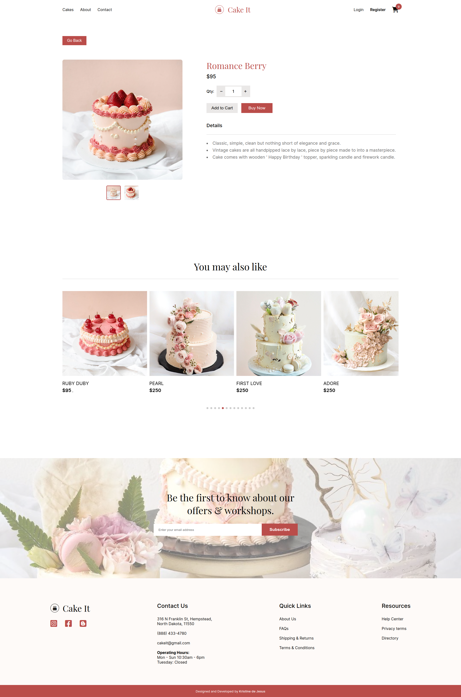

# Cake It (Cake Shop E-Commerce)
An e-commerce shop for cakes and desserts


## 📖 Table of contents
  - [Overview](#overview)
    - [Features](#features)
    - [Screenshot](#screenshot)
    - [Built with](#built-with)
    - [Running the App Locally](#running-the-app-locally)
    - [Links](#links)
- [Author](#author)

## 🔍 Overview

### Features 📂

Users should be able to:

- Filter cakes by categories (Wedding, Vintage or Monogram)
- Click the list of cakes and take them to a different page with the Cake details such as prices and specifications
- Add to cart and buy the products
- Fill in the form on the CTA section for the shop's newsletter

### Screenshot 📸



### Built with 🔨

- MaterialUI
- SCSS
- Mobile-first workflow
- ReactJS (JXS, Hooks, Routing, Context API)
- [npmjs](https://www.npmjs.com/)
- [Goole Fonts](https://fonts.google.com/knowledge)
- [Fontawesome](https://fontawesome.com/)

### Running the App Locally 💻
This app runs on Node.js. If Node.js is installed, you may clone the repository and install its dependencies:
```
npm install
```

### Links 🔗

- Solution URL: https://github.com/sn-tin/cake-shop
- Live Site URL: https://rest-countries-sn-tin.vercel.app/

## 👩‍💻 Author

- Github - [@sn-tin](https://github.com/sn-tin/)